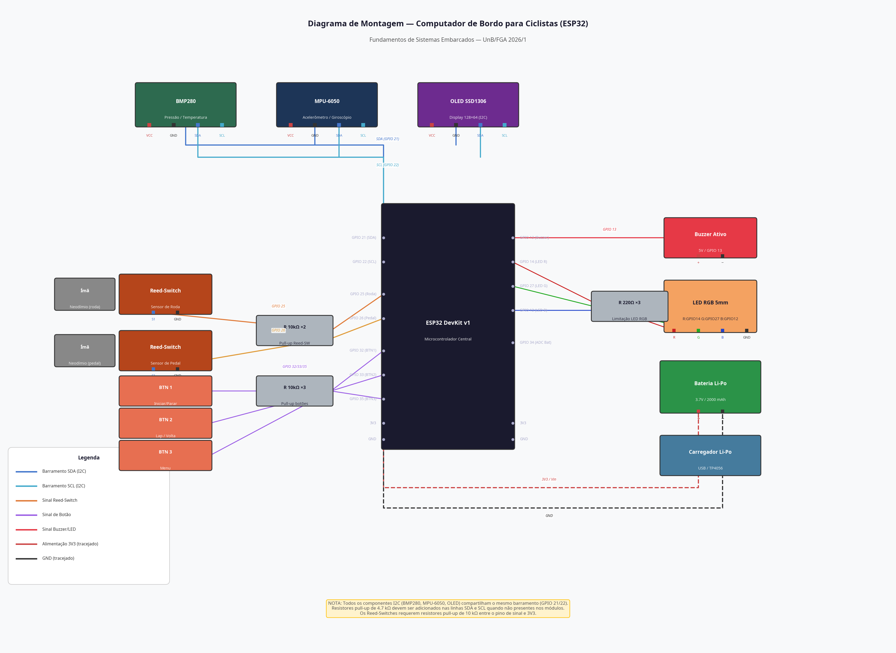

# Guia de Execução e Upload para o ESP32

Este documento fornece as instruções passo a passo para configurar o ambiente de desenvolvimento, compilar o código-fonte (com ou sem RTOS) e realizar o upload do firmware para o microcontrolador ESP32 DevKit v1.

---

## 1. Diagrama de Montagem Física

Antes de prosseguir com o upload do código, certifique-se de que o circuito esteja montado corretamente. O diagrama abaixo detalha todas as conexões físicas entre o ESP32 e os periféricos.



> **Atenção**: Verifique duplamente as conexões de alimentação (3V3 e GND) antes de conectar o ESP32 via USB ao computador. Conexões invertidas podem danificar permanentemente o microcontrolador e os sensores.

---

## 2. Preparação do Ambiente de Desenvolvimento

Recomendamos o uso do **PlatformIO** integrado ao Visual Studio Code (VS Code) devido ao seu excelente gerenciamento de dependências e suporte nativo ao framework ESP-IDF/Arduino. A IDE Arduino tradicional também pode ser utilizada, mas exigirá a instalação manual das bibliotecas.

### 2.1 Instalação do PlatformIO (Recomendado)

1. Faça o download e instale o [Visual Studio Code](https://code.visualstudio.com/).
2. Abra o VS Code, vá até a aba de **Extensões** (`Ctrl+Shift+X`).
3. Pesquise por "PlatformIO IDE" e clique em **Install**.
4. Aguarde a instalação ser concluída (pode levar alguns minutos) e reinicie o VS Code.

### 2.2 Estrutura do Projeto

No PlatformIO, o projeto deve seguir a seguinte estrutura de diretórios:

```text
BikeComputer_ESP32/
├── lib/                      # Bibliotecas privadas (se houver)
├── src/                      # Código-fonte (.cpp e .h)
│   ├── main.cpp              # Ponto de entrada
│   └── config.h              # Configurações de pinos e limiares
├── platformio.ini            # Arquivo de configuração do ambiente
└── data/                     # Arquivos a serem gravados na SPIFFS (opcional)
```

### 2.3 Configuração do `platformio.ini`

Crie ou substitua o arquivo `platformio.ini` na raiz do seu projeto com o conteúdo abaixo. Este arquivo gerencia automaticamente o download de todas as bibliotecas necessárias.

```ini
[env:esp32dev]
platform = espressif32
board = esp32dev
framework = arduino

; Velocidade do monitor serial
monitor_speed = 115200

; Velocidade de upload
upload_speed = 921600

; Configurações para FreeRTOS (se estiver usando a versão RTOS)
build_flags =
    -DCONFIG_FREERTOS_HZ=1000
    -DCORE_DEBUG_LEVEL=3

; Bibliotecas necessárias que serão baixadas automaticamente
lib_deps =
    adafruit/Adafruit BMP280 Library @ ^2.6.8
    adafruit/Adafruit Unified Sensor @ ^1.1.9
    electroniccats/MPU6050 @ ^1.3.0
    adafruit/Adafruit SSD1306 @ ^2.5.9
    adafruit/Adafruit GFX Library @ ^1.11.9
```

---

## 3. Procedimento de Upload (Gravação)

Siga as etapas abaixo para transferir o firmware compilado para o ESP32.

### Passo 1: Conexão Física

1. Conecte o ESP32 DevKit v1 ao computador utilizando um cabo micro-USB.
2. Certifique-se de que o cabo suporta transferência de dados (alguns cabos mais baratos servem apenas para carregamento de energia).

### Passo 2: Identificação da Porta Serial

O PlatformIO geralmente detecta a porta automaticamente. Caso precise verificar:
- **No Windows**: Abra o "Gerenciador de Dispositivos" e procure em "Portas (COM e LPT)" (ex: `COM3`, `COM4`).
- **No Linux/macOS**: O dispositivo aparecerá como `/dev/ttyUSB0` ou `/dev/cu.usbserial-0001`.

### Passo 3: Compilação e Upload no PlatformIO

1. Abra a pasta do projeto no VS Code.
2. Na barra inferior azul do PlatformIO, clique no ícone de **Check (✓)** para compilar o código (`Build`). Verifique se a compilação ocorre sem erros.
3. Clique no ícone de **Seta para a direita (→)** para iniciar o processo de gravação (`Upload`).
4. Acompanhe o terminal inferior. O processo exibirá mensagens como `Writing at 0x00010000... (100 %)`.
5. Quando aparecer `Leaving... Hard resetting via RTS pin...`, o upload foi concluído com sucesso.

### Resolução de Problemas no Upload

Se o upload falhar com a mensagem `A fatal error occurred: Failed to connect to ESP32: Timed out waiting for packet header`:

1. Inicie o upload novamente.
2. Quando o terminal exibir `Connecting...`, pressione e segure o botão físico **BOOT** na placa do ESP32.
3. Assim que a porcentagem de gravação começar a aparecer, solte o botão BOOT.

---

## 4. Execução e Monitoramento

### 4.1 Monitor Serial

Para visualizar as mensagens de depuração e verificar se os sensores foram inicializados corretamente:

1. Clique no ícone de **Tomada** na barra inferior do PlatformIO (`Serial Monitor`).
2. Pressione o botão físico **EN** (Enable/Reset) no ESP32 para reiniciar o microcontrolador.
3. Observe a saída no terminal. Você deve ver mensagens de inicialização do sistema, montagem da memória SPIFFS e detecção dos dispositivos I2C (BMP280, MPU-6050 e OLED).

### 4.2 Teste dos Sensores (Validação Inicial)

Antes de fixar o dispositivo na bicicleta, realize estes testes de bancada:

1. **Acelerômetro**: Incline a protoboard/placa em diferentes ângulos e verifique se o display reflete as mudanças de gradiente. Agite a placa bruscamente para simular uma queda e verificar o acionamento do alarme.
2. **Temperatura/Pressão**: Sopre ar quente sobre o sensor BMP280 ou aproxime o dedo; a temperatura no display deve subir.
3. **Velocidade/Cadência**: Passe um dos ímãs de neodímio rapidamente sobre os Reed-Switches e observe o incremento da velocidade/cadência no display.
4. **Botões**: Teste a navegação entre as telas (Main, Altitude, Cadence, Stats) utilizando os botões físicos configurados.

---

## 5. Preparação para Uso em Campo (Bicicleta)

### 5.1 Alimentação por Bateria

Após validar o funcionamento via USB:
1. Desconecte o cabo USB do computador.
2. Conecte a bateria Li-Po 3.7V ao módulo carregador TP4056, e a saída do carregador aos pinos Vin (ou 5V) e GND do ESP32.
3. O sistema deve inicializar autonomamente.

### 5.2 Montagem na Bicicleta

1. **Unidade Central**: Fixe o case impresso em 3D no guidão utilizando abraçadeiras de nylon ou suporte específico.
2. **Sensor de Roda**: Fixe um Reed-Switch no garfo dianteiro (voltado para dentro) e um ímã de neodímio em um dos raios da roda, garantindo que a distância entre eles ao passarem seja inferior a 5 mm.
3. **Sensor de Cadência**: Fixe o segundo Reed-Switch no quadro (chainstay) e o segundo ímã no pedivela, seguindo a mesma tolerância de distância.
4. Conecte os fios dos sensores à unidade central garantindo folga suficiente para o movimento do guidão.
