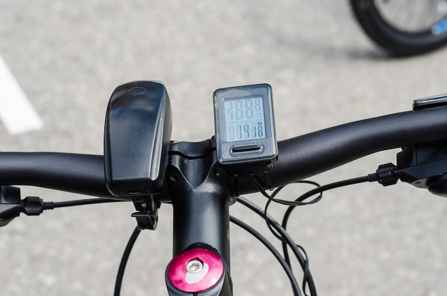

# Computador de Bordo para Ciclistas (Garmin Edge 850)

## Integrantes

## Alunos

<center>
  
|  |  |
| :---: | :---: |
| [Lucas Oliveira Meireles](https://github.com/Katuner) | [Pedro Ramos Sousa Reis](https://github.com/PedroRSR) |
  
</center>

| Nome completo | Matrícula |
|---|---|
| Lucas Oliveira Meirels | 190016647 |
| Pedro Ramos Sousa Reis | 222031680 |

## 1. Descrição do Produto

Este trabalho analisa o computador de bordo para ciclistas, utilizando como referência técnica o modelo **Garmin Edge 850**. Os ciclocomputadores com GPS são dispositivos eletrônicos instalados no guidão da bicicleta, desenvolvidos para coletar, armazenar, processar e exibir métricas da atividade de ciclismo em tempo real.

As funções principais destes dispositivos englobam a medição detalhada de métricas de desempenho em tempo real, tais como velocidade instantânea e média, distância percorrida, tempo de atividade em movimento e elevação acumulada. Além das métricas básicas, eles oferecem navegação avançada com mapas detalhados e direções curva a curva, essenciais para a exploração de novas rotas. Outro aspecto fundamental é o monitoramento fisiológico avançado, que ocorre quando o dispositivo é conectado a sensores externos, permitindo a análise da frequência cardíaca, potência aplicada nos pedais e cadência de pedalada. Adicionalmente, os ciclocomputadores modernos oferecem recursos vitais de segurança, como rastreamento de localização em tempo real (LiveTrack) para compartilhamento com familiares e algoritmos de detecção automática de incidentes que enviam alertas em caso de quedas abruptas [1].

O público-alvo deste produto abrange uma ampla gama de usuários, desde ciclistas entusiastas que buscam melhorar seu condicionamento físico até atletas amadores e profissionais que dependem de dados precisos para estruturar seus treinamentos. Cicloturistas e aventureiros também compõem uma parcela significativa dos usuários, necessitando primariamente da navegação confiável em locais desconhecidos. O contexto de uso do dispositivo é caracterizado pela exposição constante a condições ambientais variáveis e frequentemente adversas, incluindo chuva intensa, radiação solar direta, poeira, lama e fortes vibrações provenientes do terreno. O equipamento opera como a central de processamento e exibição de informações do ciclista durante toda a atividade, coletando e processando simultaneamente dados de constelações de satélites e de múltiplos sensores sem fio espalhados pela bicicleta e pelo corpo do atleta. 

No contexto da disciplina de Fundamentos de Sistemas Embarcados, o modelo conceitual proposto tem finalidade educacional. O sistema documentado serve como base de estudo para a arquitetura de hardware, processamento de sinais e telemetria esportiva, independentemente de marcas comerciais específicas.

<center>


*(Figura 1: Exemplo de um computador de bordo montado no guidão de uma bicicleta em uso)*
</center>

## 2. Análise Técnica do Funcionamento

A arquitetura de hardware de um ciclocomputador atual aproxima-se da complexidade de um dispositivo móvel dedicado. O sistema é formado por módulos independentes que operam de forma integrada para coletar e processar dados, priorizando a eficiência energética.

### 2.1 Principais Módulos do Sistema

**Sensores**

O subsistema de aquisição de dados depende de sensores internos operando continuamente durante o deslocamento da bicicleta.

| Componente | Funcionalidade | Faixa | Precisão | Referência |
|---|---|---|---|---|
| Receptor GNSS Multi-banda | Determinação de posicionamento global, cálculo de velocidade instantânea e registro de distância percorrida | Global | ±3 a 5 metros | [2] |
| Acelerômetro de 3 eixos | Detecção de movimento contínuo, algoritmos de identificação de incidentes (quedas) e métricas específicas de mountain bike (saltos) | ±2g a ±16g | Alta | [3] |
| Altímetro Barométrico | Medição contínua de elevação, cálculo de subida acumulada e determinação da inclinação atual do terreno | 300 a 1100 hPa | ±1 metro | [3] |
| Termômetro Digital | Medição da temperatura ambiente para compensação térmica de outros sensores e registro de dados climáticos | -20°C a 60°C | ±1°C | [3] |
| Sensor de Luz Ambiente | Ajuste automático e dinâmico do brilho da tela para otimizar a visibilidade e conservar energia da bateria | 0 a 65000 lux | - | [3] |

**Atuadores**

Os componentes de saída fornecem feedback visual e sonoro ao ciclista durante o uso do equipamento.

| Componente | Funcionalidade | Referência |
|---|---|---|
| Display Touchscreen Colorido | Exibição dinâmica de mapas vetoriais, campos de dados personalizáveis, gráficos de desempenho e interface geral com o usuário | [1] |
| Buzzer Piezoelétrico | Emissão de alertas sonoros de alta frequência para indicações de navegação, notificações de mensagens e alarmes de segurança | [1] |

**Controle**

A unidade de processamento central deve conciliar a capacidade computacional necessária para renderização gráfica com os requisitos de baixo consumo de energia.

| Componente | Funcionalidade | Referência |
|---|---|---|
| Microcontrolador Principal (SoC) | Processamento central de dados, renderização gráfica de mapas, execução de algoritmos de cálculo de métricas e gerenciamento rigoroso de energia | [4] |
| Memória Flash Interna | Armazenamento persistente de mapas base geográficos, histórico detalhado de atividades e arquivos do sistema operacional | [4] |

**Interface**

A interação com o dispositivo deve ser possível em cenários desafiadores, como durante chuvas intensas ou utilizando luvas grossas de inverno.

| Componente | Funcionalidade | Referência |
|---|---|---|
| Painel Sensível ao Toque | Navegação fluida pelos menus do sistema, manipulação de mapas (zoom e pan) e configuração rápida de campos de dados | [1] |
| Botões Físicos Táteis | Execução de ações críticas que exigem feedback tátil positivo, como iniciar ou parar o registro de uma atividade e marcar voltas (laps) | [1] |

**Conectividade**

Os módulos de comunicação permitem que o dispositivo opere como um hub central, recebendo dados de múltiplos sensores periféricos sem fio instalados na bicicleta.

| Componente | Funcionalidade | Referência |
|---|---|---|
| Transceptor de Rede ANT+ | Comunicação de baixíssimo consumo energético com sensores periféricos da bicicleta (medidores de potência, cadência, radar de veículos) | [5] |
| Módulo Bluetooth Low Energy | Conexão estável com o smartphone do usuário para recebimento de notificações, sincronização de dados e conexão com sensores compatíveis | [5] |
| Controlador Wi-Fi | Sincronização rápida e de alto volume de dados, como download de rotas complexas e upload de atividades concluídas para plataformas em nuvem | [5] |

### 2.2 Identificação de Tecnologias Críticas

O desenvolvimento de um ciclocomputador de ponta baseia-se na implementação bem-sucedida de diversas tecnologias críticas que diferenciam um produto comercial de um mero protótipo funcional.

| Tecnologia Crítica | Componente | Aplicação e Importância | Referência |
|---|---|---|---|
| Posicionamento de Alta Precisão | Chipset GNSS Multi-banda | Fundamental para a navegação precisa e o cálculo exato de velocidade e distância em ambientes topográficos desafiadores, como florestas densas e cânions urbanos, onde os sinais de GPS de banda única frequentemente sofrem degradação por multicaminho. | [2] |
| Comunicação de Baixo Consumo | Protocolo Proprietário ANT+ | Permite que uma complexa rede de múltiplos sensores distribuídos na bicicleta opere continuamente por meses ou anos utilizando pequenas baterias tipo moeda, transmitindo dados simultaneamente para a unidade central sem interferências significativas. | [5] |
| Fusão Avançada de Sensores | Algoritmos em Firmware | Combina matematicamente os dados do receptor GPS, do acelerômetro e do barômetro para calcular métricas complexas (como a inclinação atual expressa em porcentagem ou a detecção precisa de acidentes), mitigando ativamente as limitações e os ruídos individuais inerentes a cada sensor isolado. | [6] |
| Gerenciamento Agressivo de Energia | Sistema Operacional Embarcado | Crítico para garantir uma autonomia operacional superior a vinte horas com a tela constantemente ligada e processamento de GPS ativo, utilizando técnicas avançadas de duty cycling e estados de suspensão profunda e seletiva de componentes de hardware não utilizados no momento. | [7] |

## 3. Proposta de Reprodução com ESP32

### 3.1 Visão Geral da Proposta

A implementação proposta utiliza o microcontrolador ESP32 como unidade central de processamento para um protótipo de computador de bordo. O sistema embarcado monitorará as variáveis de velocidade, distância, elevação e temperatura ambiente. Os dados processados serão exibidos em um display local e armazenados em memória para análise posterior. O protótipo demonstra os princípios de engenharia de software embarcado, incluindo a integração de sensores via I2C e GPIO, processamento de interrupções de hardware, e gerenciamento de interface de usuário em displays de baixo custo.

### 3.2 Funcionalidades a serem reproduzidas

Para viabilizar o projeto dentro das restrições de componentes de baixo custo, as funcionalidades originais foram mapeadas para recursos equivalentes disponíveis no ecossistema de desenvolvimento do ESP32.

| Funcionalidade original | Recurso equivalente proposto com ESP32 e Sensores |
|---|---|
| Medição de velocidade e distância | Utilização de Chave Magnética Digital (Reed-Switch) instalada no garfo e um ímã nos raios da roda para calcular a velocidade baseada no perímetro do pneu. |
| Medição de elevação e inclinação | Implementação do Sensor de Pressão e Temperatura BMP280 via barramento I2C para calcular a variação de altitude baseada na pressão atmosférica. |
| Exibição de dados em tempo real | Integração de uma Tela OLED 0.98" (I2C) para criar uma interface de usuário com múltiplos campos de dados numéricos atualizados em tempo real. |
| Registro de rotas e telemetria | Utilização da memória flash interna do ESP32 (via sistema de arquivos SPIFFS) para armazenar os dados coletados em formato CSV. |
| Feedback e alertas de segurança | Incorporação de um Buzzer Ativo e Leds RGB 5mm para fornecer feedback sonoro e visual sobre o início/fim de atividades e alertas de inclinação excessiva. |

### 3.3 Arquitetura Conceitual

O sistema utiliza o microcontrolador ESP32 como nó central. A comunicação com o sensor BMP280 e o display OLED ocorre via barramento I2C. A aquisição de dados de velocidade e cadência utiliza interrupções de hardware (interrupts) conectadas aos sensores magnéticos (Reed-Switches). A interface física emprega botões táteis conectados aos pinos GPIO com resistores pull-up e debouncing por software. O armazenamento persistente dos dados de telemetria utiliza o sistema de arquivos SPIFFS na memória flash interna, com rotinas de gravação periódica.

### 3.4 Diagrama Conceitual (Blocos)

A arquitetura de hardware e o fluxo de dados do sistema proposto podem ser visualizados no diagrama conceitual abaixo, evidenciando a centralidade do ESP32 no gerenciamento dos periféricos.

```text
    ┌─────────────────────────────────────────────────────────┐
    │              Computador de Bordo (ESP32)                │
    │                                                         │
    │  ┌──────────────┐ I2C  ┌───────────────────────────┐    │
    │  │ Sensor BMP280│ ────→│                           │    │
    │  │ (Alt/Temp)   │      │                           │    │
    │  └──────────────┘      │                           │    │
    │                        │                           │    │
    │  ┌──────────────┐ GPIO │     Microcontrolador      │ I2C┌──────────────┐
    │  │ Reed-Switch  │ ────→│         ESP32             │───→│ Display OLED │
    │  │ (Velocidade) │(Int) │   (Processamento,         │    │ (Interface)  │
    │  └──────────────┘      │    Fusão de Dados e       │    └──────────────┘
    │                        │    Gerenciamento)         │    │
    │  ┌──────────────┐ GPIO │                           │GPIO┌──────────────┐
    │  │ Reed-Switch  │ ────→│                           │───→│ Buzzer e     │
    │  │ (Cadência)   │(Int) │                           │    │ LEDs RGB     │
    │  └──────────────┘      └───────────────────────────┘    └──────────────┘
    │                                  │                      │
    │  ┌──────────────┐ GPIO           │ Wi-Fi                │
    │  │ Botões de    │ ───────────────┘                      │
    │  │ Controle     │                ↓                      │
    │  └──────────────┘          Nuvem / App Web              │
    └─────────────────────────────────────────────────────────┘
```

### 3.5 Limitações e Desafios Esperados

A implementação com componentes acessíveis apresenta restrições técnicas específicas de hardware e software.

| Tipo | Descrição |
|---|---|
| Ausência de Posicionamento Global | Devido à não disponibilidade de um módulo GPS na lista de sensores padrão, o sistema dependerá exclusivamente de sensores de roda (Reed-Switch) para cálculo de distância. Isso impede o registro de rotas em mapas geográficos e limita a precisão da velocidade a calibrações manuais do diâmetro da roda. |
| Restrições de Armazenamento | A ausência de um módulo para cartão MicroSD restringe o armazenamento de dados à memória flash interna do ESP32 (SPIFFS). Esta limitação exigirá a implementação de algoritmos de compressão de dados ou a limitação do tempo total de registro de atividades antes que uma sincronização via Wi-Fi seja necessária. |
| Consumo de Energia | O microcontrolador ESP32, especialmente com a conectividade Wi-Fi ativa, consome considerável energia elétrica. O desafio principal de software será implementar técnicas sofisticadas de *deep sleep* e otimização de código para garantir uma autonomia operacional aceitável para atividades de ciclismo mais longas. |
| Interface Gráfica Limitada | A utilização de uma tela OLED monocromática de 0.98 polegadas, aliada à ausência de uma GPU dedicada no ESP32, limita substancialmente a criação de interfaces gráficas complexas. A solução de design focará em exibir campos de dados numéricos grandes e gráficos de barras simples, priorizando a legibilidade. |

## 4. Pesquisa Bibliográfica e Tecnológica

A revisão de literatura baseia-se em publicações sobre redes de sensores em bicicletas, arquiteturas IoT móveis e eficiência energética em sistemas embarcados.

### 4.1 Tecnologias que viabilizam o produto

**1. Smart e-bike monitoring system: real-time open source and open hardware GPS assistance and sensor data for electrically-assisted bicycles**
- **Autores**: A. Yasin, J. Delaney, C. Cheng, T. Y. Pang
- **Publicação**: IET Intelligent Transport Systems, 2015.
- **Link**: [https://ietresearch.onlinelibrary.wiley.com/doi/abs/10.1049/iet-its.2014.0251]
- **Resumo**: A pesquisa descreve o projeto de hardware e software de um sistema de monitoramento para bicicletas elétricas. A arquitetura open-source integra funções de navegação com a coleta de dados de múltiplos sensores. O artigo relata os resultados de testes de campo e propõe modificações arquiteturais para reduzir o consumo de energia em dispositivos de rastreamento de longo prazo.
- **Aplicação**: O artigo estabelece a viabilidade técnica de utilizar hardware acessível para telemetria em bicicletas. A metodologia de integração de sensores com microcontroladores genéricos descrita pelos autores aplica-se diretamente à arquitetura proposta neste trabalho baseada no ESP32.

**2. A real-time bicycle record system of ground conditions based on Internet of Things**
- **Autores**: Vários autores (IEEE)
- **Publicação**: IEEE Explore, 2017.
- **Link**: [https://ieeexplore.ieee.org/abstract/document/8013021/]
- **Resumo**: A publicação apresenta um sistema IoT para registro da dinâmica de bicicletas, integrando o processamento em smartphones com nós sensores embarcados. O estudo utiliza módulos de posicionamento global e sensores inerciais MEMS para monitorar as condições da via e o comportamento cinemático do veículo durante o deslocamento.
- **Aplicação**: A pesquisa aborda a coleta de dados em ambientes com alta vibração mecânica. O uso de sensores inerciais para inferir características do terreno é a base técnica das métricas avançadas encontradas em ciclocomputadores comerciais para mountain bike. O tratamento de ruído nos sinais inerciais descrito serve como referência para o firmware do ESP32.

**3. Enhancing Cycling Safety in Smart Cities: A Data-Driven Embedded Risk Alert System**
- **Autores**: Vários autores (MDPI)
- **Publicação**: MDPI, 2024.
- **Link**: [https://www.mdpi.com/2624-6511/7/4/79]
- **Resumo**: O artigo descreve um sistema embarcado para segurança de ciclistas em ambiente urbano. A partir de coordenadas geográficas e dados inerciais locais, o sistema calcula zonas de risco e emite alertas ao usuário. A pesquisa avalia o processamento de algoritmos de avaliação de risco em hardware com capacidade computacional restrita.
- **Aplicação**: O trabalho valida o uso de processamento local (edge computing) para analisar dados brutos de sensores em tempo real, sem dependência de conectividade externa. Esta arquitetura de processamento fundamenta a implementação da rotina de detecção autônoma de incidentes (quedas) no protótipo proposto.

**4. Sistema Embarcado para Monitoramento Automotivo em Tempo Real**
- **Autores**: Rubens Moreno de Oliveira
- **Publicação**: CEFET-MG, 2022.
- **Link**: [https://www.eng-automacao.araxa.cefetmg.br/wp-content/uploads/sites/152/2022/08/TCC2-Rubens-Moreno-de-Oliveira.pdf]
- **Resumo**: O documento descreve um sistema embarcado para monitoramento veicular baseado em sensores MEMS (giroscópio, acelerômetro) e sensores de temperatura. A pesquisa detalha os métodos matemáticos de calibração dos sensores inerciais e a estruturação de pacotes de dados para telemetria sem fio.
- **Aplicação**: A arquitetura de hardware e as técnicas de tratamento de sinal (calibração de acelerômetro e giroscópio) são independentes do tipo de veículo. Os algoritmos de filtragem de dados inerciais descritos no estudo são aplicáveis à rotina de leitura do sensor MPU-6050 no ESP32.

### 4.2 Artigos sobre aplicação / uso do produto

**1. Em defesa da caminhada e do uso de bicicleta como deslocamento no Brasil**
- **Autores**: A. A. Florindo, G. S. Goulardins, et al.
- **Publicação**: Cadernos de Saúde Pública (SciELO), 2025.
- **Link**: [https://www.scielosp.org/article/csp/2025.v41n2/e00099324/]
- **Resumo**: A pesquisa analisa o uso da bicicleta no deslocamento urbano ativo. O estudo metodológico emprega dispositivos de rastreamento e acelerômetros embarcados para registrar coordenadas, distâncias e o esforço físico dos usuários em vias urbanas no Brasil.
- **Aplicação**: A pesquisa exemplifica a aplicação de dados telemétricos em análises de mobilidade urbana e saúde pública. A dependência de dados precisos de aceleração e posicionamento reforça a necessidade de confiabilidade no hardware de registro (data logging) de ciclocomputadores.

**2. Intelligent Bicycle Safety and Tracking System: A GPS and GSM-Based Approach**
- **Autores**: Ibrahim A. Ameen
- **Publicação**: Jupiter Publikasi Ilmu Keteknikan, 2025.
- **Link**: [https://www.researchgate.net/publication/387998773_Intelligent_Bicycle_Safety_and_Tracking_System_A_GPS_and_GSM-Based_Approach]
- **Resumo**: A publicação detalha o projeto de um sistema de rastreamento e segurança para bicicletas baseado em placas de prototipagem, módulos GSM/GPS e sensor inercial MPU-6050. O sistema correlaciona dados de velocidade e inclinação para controlar autonomamente um atuador (iluminação traseira), comunicando desacelerações aos veículos próximos.
- **Aplicação**: A pesquisa demonstra a integração entre dados de sensores inerciais e atuadores físicos em tempo real. O uso do MPU-6050 para detecção de frenagem fornece a base algorítmica para implementar alertas de segurança no projeto com ESP32.

**3. Adaptive GPS duty cycling and radio ranging for energy-efficient localization**
- **Autores**: Vários autores (ACM)
- **Publicação**: ACM Digital Library, 2010.
- **Link**: [https://dl.acm.org/doi/10.1145/1869983.1869990]
- **Resumo**: O artigo investiga métodos para otimizar o consumo de energia em nós sensores móveis. O estudo propõe o uso de *duty cycling* (gerenciamento do ciclo de trabalho) adaptativo no módulo receptor GPS, intercalando leituras de alto consumo com dados de sensores inerciais de baixo consumo para manter a precisão de localização enquanto preserva a carga da bateria.
- **Aplicação**: A técnica de *duty cycling* adaptativo abordada no artigo é aplicável ao gerenciamento de energia do ESP32. A variação da taxa de amostragem dos sensores (BMP280 e MPU-6050) com base no estado cinemático da bicicleta permite estender a autonomia da bateria Li-Po no protótipo.

**4. CAMINHOS: A BICICLETA COMO INSTRUMENTO DE ARTE**
- **Autores**: G. C. dos Santos
- **Publicação**: Revista Científica/FAP, 2023.
- **Link**: [https://periodicos.unespar.edu.br/revistacientifica/article/view/7574]
- **Resumo**: A pesquisa aborda o uso do ciclocomputador como ferramenta de registro espacial no ambiente urbano. O autor utiliza a função de gravação de coordenadas geográficas do dispositivo embarcado para mapear rotas que formam representações gráficas sobre a malha viária da cidade.
- **Aplicação**: A aplicação descrita no artigo depende da estabilidade do subsistema de *data logging*. A necessidade de registrar coordenadas contínuas sem perda de dados reforça os requisitos técnicos de gravação persistente na memória flash (SPIFFS) propostos para a arquitetura do ESP32.

## 5. Comparativo com Produtos Similares

A análise de mercado abrange diferentes categorias de computadores de bordo para ciclismo, comparando especificações de hardware e características de firmware entre dispositivos de diferentes fabricantes.

### 6.1 Lista de Produtos Relacionados e Tabela Comparativa

| Nome do Produto | Geração / Lançamento | Principais Especificações Técnicas | Características Principais e Diferenciais | Preço Estimado | Observações de Mercado |
|---|---|---|---|---|---|
| **Garmin Edge 850** (Produto Estudado) | Atual (Recente) | Tela 2.6" Touch colorida de alta visibilidade, chipset Multi-GNSS de dupla frequência, Bateria com autonomia de 20h+, conectividade abrangente Wi-Fi/BT/ANT+ | Oferece navegação turn-by-turn extremamente avançada, métricas de treino dinâmicas que se adaptam ao ciclista e algoritmos preditivos de subida (ClimbPro). | Premium | Considerado o padrão ouro da indústria para ciclistas focados em alta performance e navegação complexa, possuindo o maior ecossistema de sensores compatíveis. |
| **Hammerhead Karoo 3** | Atual | Tela 3.2" Touch colorida de altíssima resolução, sistema operacional baseado em Android, Multi-GNSS, Bateria de 15h | Apresenta uma interface de usuário altamente fluida e intuitiva semelhante a um smartphone moderno, possuindo a melhor renderização visual de mapas da categoria. | Premium | Posiciona-se como o principal concorrente tecnológico em termos de usabilidade e design de software. A marca foi recentemente adquirida pelo conglomerado SRAM. |
| **Wahoo ELEMNT BOLT V2** | Geração Anterior | Tela 2.2" Colorida não-touch de alto contraste, suporte a GPS/GLONASS, Bateria de 15h, conectividade BT/ANT+ | Destaca-se pelo uso exclusivo de botões físicos táteis, design focado em aerodinâmica e uma faixa de LEDs programáveis indicadores no topo do aparelho. | Intermediário | Mantém um foco rigoroso na simplicidade de uso, confiabilidade extrema sob chuva e configuração realizada 100% via aplicativo de smartphone. Altamente popular no pelotão profissional. |
| **Coros Dura Solar** | Atual | Tela 2.7" Touch colorida MIP, Multi-GNSS, Bateria com impressionantes 120h de autonomia (com auxílio solar) | Apresenta autonomia de bateria sem precedentes no mercado, painel solar de alta eficiência integrado à tela e um inovador botão giratório lateral para navegação em menus. | Intermediário | Disruptivo no aspecto energético; é considerado o equipamento ideal para competições de ultra-endurance, bikepacking e expedições de múltiplos dias longe de tomadas. |
| **Magene C406 Pro** | Atual (Budget) | Tela 2.4" LCD monocromática segmentada, suporte a 4 sistemas de satélite, Bateria de 28h, BT/ANT+ | Apesar do baixo custo, oferece suporte completo a sensores avançados de potência e integração com radares de trânsito, além de telas altamente personalizáveis. | Entrada (Budget) | Representa um excelente custo-benefício que democratizou o acesso a métricas avançadas de treinamento para ciclistas amadores com orçamentos restritos. |
| **Beeline Velo 2** | Atual (Urbano) | Tela circular compacta monocromática, não possui GPS interno (depende integralmente do hardware do smartphone pareado) | Foca em navegação urbana intuitiva por meio de uma "bússola inteligente" que aponta a direção geral ou roteamento simplificado em uma interface minimalista. | Entrada | Possui um foco arquitetural exclusivo em navegação urbana simples para deslocamentos diários, não competindo no segmento de métricas de treino esportivo ou performance. |

---

### Referências

[1] Garmin. "Bike Computers | Bike Radars & Bike Light | Power Meters - Garmin." Disponível em: https://www.garmin.com/en-US/c/sports-fitness/cycling-bike-computers-bike-radar-power-meter-headlights/

[2] REI Co-op. "Bike Computers: How to Choose | REI Expert Advice." Disponível em: https://www.rei.com/learn/expert-advice/bike-computer.html

[3] Polar. "CYCLING COMPUTER PARTS | Polar CS600X User Manual." Disponível em: https://support.polar.com/e_manuals/CS600X/Polar_CS600X_user_manual_English/ch02.html

[4] Cycling Weekly. "Best bike computers 2026: top-rated units best for training & routing." Disponível em: https://www.cyclingweekly.com/group-tests/cycling-gps-units-buyers-guide-181254

[5] Coospo. "Computadora para bicicleta con GPS Acerca de las características." Disponível em: https://www.coospo.com/es/blogs/conocimiento/funciones-importantes-que-conocer-sobre-el-ordenador-para-bicicleta-gps

[6] ResearchGate. "Intelligent Bicycle Safety and Tracking System: A GPS and GSM-Based Approach." Disponível em: https://www.researchgate.net/publication/387998773_Intelligent_Bicycle_Safety_and_Tracking_System_A_GPS_and_GSM-Based_Approach

[7] ACM Digital Library. "Adaptive GPS duty cycling and radio ranging for energy-efficient localization." Disponível em: https://dl.acm.org/doi/10.1145/1869983.1869990
